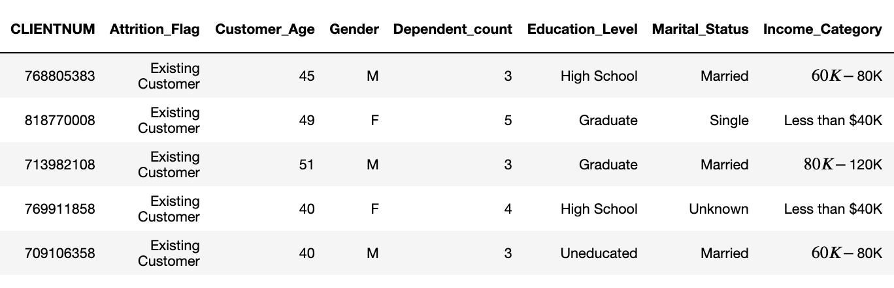

# Predict Customer Churn

- Project **Predict Customer Churn** of ML DevOps Engineer Nanodegree Udacity

## Project Description
 - Project goal: Identify credit card customers who are most likely to cancel their cards.
 - Project objectives:
    - Implement learnings related to clean code principles.
    - Develop a Python package for a machine learning project that follows best practices for writing and designing code.
- Project deliverables:
    - A Python package for a machine learning project that can be used to predict customer churn.

## Files and data description
#### Dataset
   - Dataset is pulled from [Kaggle](https://www.kaggle.com/datasets/sakshigoyal7/credit-card-customers/code)
  
        
#### File Structure
    ```bash
    .
    ├── Guide.ipynb          # Given: Getting started and troubleshooting tips
    ├── churn_notebook.ipynb # Given: Contains the code to be refactored
    ├── churn_library.py     # ToDo: Define the functions
    ├── churn_script_logging_and_tests.py # ToDo: Finish tests and logs
    ├── README.md            # ToDo: Provides project overview, and instructions to use the code
    ├── data                 # Read this data
    │   └── bank_data.csv
    ├── images               # Store EDA results 
    │   ├── eda
    │   └── results
    ├── logs				 # Store logs
    └── models               # Store models
    ```
#### Important files
  
  - **churn_notebook.ipynb**: Already provided notebook with implementation but without proper formats
  - **churn_library.py**: The churn_library.py is a library of functions to find customers who are likely to churn.
  - **churn_script_logging_and_tests.py**:
         
      This file should - 
      - Contain unit tests for the churn_library.py functions. You have to write test for each input function. Use the basic assert statements that test functions work properly. The goal of test functions is to checking the returned items aren'
      t empty or folders where results should land have results after the function has been run.
      - Log any errors and INFO messages. You should log the info messages and errors in a .log file, so it can be viewed post the run of the script. The log messages should easily be understood and traceable.
  - **README.md**: This file will provide an overview of the project, the instructions to use the code

## Churn Library function sequence diagram
   
## Prerequisites
   - Python 3.8.x
   - virtual environment setup
## Running Files
 #### Create virtual environment
    ```python
    # For Linux
    python3 -m venv venv
    or
    # For Windows
    python.exe -m venv venv
    ```
  #### Activate virtual environment
    ```python
    # For Linux
    source venv/bin/activate
    or 
    # For Windows
    ./venv/Scripts/activate
    ```
 #### Install dependencies using requirements file
    ```python
    pip install -r requirements.txt
    ```
 #### Run scripts
   - Create models and report
        ```python
        python churn_library.py
        ```
   - Test Script
        ```python
        python churn_script_logging_and_tests.py
        ``` 
 #### Code quality considerations
   - Format code using [PEP8 - Style Guide](https://peps.python.org/pep-0008/)
        ```python
        autopep8 --in-place --aggressive --aggressive churn_script_logging_and_tests.py
        autopep8 --in-place --aggressive --aggressive churn_library.py
        ```
   - Style checking and error spotting using [Pylint](https://pypi.org/project/pylint/)
        ```python
        pylint churn_library.py
        pylint churn_script_logging_and_tests.py
        ```